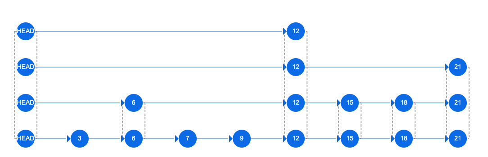

# 层次化可导航小世界

`HNSW`（Hierarchical Navigable Small World）是一种用于高效近似最近邻搜索的图索引结构。它结合了跳表的层次化结构和小世界特性，能够在高维空间中快速找到近似最近邻。

HNSW 的主要特点包括：

1. **层次化结构**：HNSW 将数据点组织成多个层次，每个层次包含不同数量的节点。通过这种方式，可以快速缩小搜索范围，减少不必要的计算。
2. **小世界特性**：HNSW 通过随机连接和跳跃，构建了一个具有小世界特性的图结构。这种结构使得搜索路径更加多样化，提高了搜索效率。
3. **动态更新**：HNSW 支持动态插入和删除操作，能够实时更新索引结构，适应数据变化。

HNSW 在许多实际应用中表现出色，特别是在大规模数据集和高维空间中。它广泛应用于搜索引擎、推荐系统、图像检索等领域。

  

`HNSW`结合了两个核心概念， 即`跳表`和`小世界`， 下面我们针对这两个概念进行详细介绍。

## 跳表

跳表是一种数据结构， 它允许我们快速地进行范围查询和最近邻搜索。 跳表的实现方式是， 将数据存储在多个层次的链表中， 每个层次的链表都比前一个层次的链表更大。 这样， 我们就可以通过跳表来快速地找到数据。

下图展示了跳表的结构：  

 
### 跳表构建

### 调表查询

## 小世界

### 小世界构建
### 小世界查询

## 层次化可导航小世界

