# 使用层次化可导航小世界图进行高效且稳健的近似最近邻搜索
作者：Yu. A. Malkov, D. A. Yashunin   翻译：GPT-4o, ULis3h
## 摘要
我们提出了一种基于可导航小世界图的新方法，用于近似`K`最近邻搜索，该方法具有可控的层次结构（Hierarchial  NSW， HNSW）。这个解决方案是完全基于图的，不需要任何额外的搜索结构，这通常在大多数近邻图技术的粗略搜索阶段使用， 分层`NSW`逐步构建一个多层结构，该结构由用于存储元素的嵌套子集的分层近邻图（层）组成。元素所在的最大层是通过指数衰减的概率分布随机选择的。这使得生成的图与之前研究的可导航小世界（NSW）结构类似，同时额外地根据其特征距离尺度分离链接。从上层开始搜索并利用尺度分离，相较于`NSW`提升了性能，并实现了对数复杂度的扩展。在高召回率和高度聚类数据的情况下，额外采用启发式方法来选择近似图邻域，可以显著提高性能。性能评估结果表明，所提出的一般度量空间搜索索引的性能远优于之前的开源的、最先进的纯向量方法。算法结构与跳表类似，这使得其可以直接均衡的分布式实现。

## 关键词
图和树的搜索策略，人工智能，信息搜索与检索，信息存储与检索，信息技术与系统，搜索过程，图和网络，数据结构，近邻搜索，大数据，近似搜索，相似性搜索。

## 1 引言
不断增长的信息资源数量导致了对可扩展且高效的相似性搜索数据结构的高度需求。`K`近邻搜索（K-NNS）是信息搜索中常用的一种方法。`K-NNS`假设数据元素之间有一个提前定义的距离函数，目标是从数据集中找到与给定查询距离最小的`K`个元素。这种算法在许多应用中都有使用，例如非参数化的机器学习算法、大规模数据库中的图像特征匹配和语义文档检索。`K-NNS`的一种朴素方法是计算查询与数据集中每个元素之间的距离，然后选择距离最小的元素。然而，这种朴素方法的复杂度随着存储元素数量线性增长，使得它在大规模数据集上不可行。这促使人们对快速且可扩展的`K-NNS`算法的开发产生了极大的兴趣。

`K-NNS`的精确解仅在相对低维数据的情况下才能显著加快搜索速度，这是由于“维度灾难”的影响。为了解决这个问题，提出了近似最近邻搜索（`K-ANNS`）的概念，它通过允许少量错误来放宽精确搜索的条件。非精确搜索的质量（召回率）被定义为找到的真实最近邻数量与`K`的比值。最流行的`K-ANNS`解决方案基于树算法的近似版本、局部敏感哈希（`LSH`）和乘积量化（`PQ`）。最近，基于邻近图的`K-ANNS`算法因其在高维数据集上的更好表现而逐渐流行。然而，邻近图路由的幂律扩展在处理低维或聚类数据时会导致性能严重下降。

在本文中，我们提出了分层可导航小世界（Hierarchical NSW，`HNSW`），这是一种全新的完全基于图的增量式K-ANNS结构，能够提供更好的对数复杂度扩展。主要贡献包括：明确选择图的入口节点、通过不同的尺度分隔链接，以及使用高级启发式方法选择邻居。或者，可以将分层NSW算法视为概率跳表结构的扩展，但用邻近图替代了链表。性能评估表明，所提出的一般度量空间方法能够显著超越之前仅适用于向量空间的开源最先进方法。

## 2 相关研究
### 2.1 邻近图技术
在绝大多数研究的图算法中，搜索采用的是`k`近邻（`k-NN`）图中的贪婪路由形式。对于给定的邻近图，搜索从某个入口点开始（可以是随机的，也可以由单独的算法提供），然后迭代地遍历图。在遍历的每一步中，算法会检查查询点与当前基节点邻居之间的距离，然后选择距离最小的相邻节点作为下一个基节点，同时不断跟踪发现的最佳邻居。当满足某些停止条件（例如距离计算的次数）时，搜索终止。在`k-NN`图中，指向最近邻的链接作为`Delaunay`图（一种保证基本贪婪图遍历结果始终为最近邻的图）的简单近似。不幸的是，如果没有关于空间结构的先验信息，就无法高效地构建`Delaunay`图，但通过仅使用存储元素之间的距离，可以通过最近邻对其进行近似。研究表明，使用这种近似的邻近图方法在性能上与其他`k-ANNS`技术（如kd树或LSH）具有竞争力。

`k-NN`图方法的主要缺点是：  
1）在路由过程中，随着数据集规模的增大，步骤数量呈幂律增长；
2）可能丧失全局连通性，从而导致在聚类数据上的搜索结果较差。为了解决这些问题，已经提出了许多混合方法，这些方法使用了仅适用于向量数据的辅助算法（例如kd树和乘积量化），通过粗略搜索为入口节点找到更好的候选点。

在文献 [25, 26, 30] 中，作者提出了一种基于邻近图的`K-ANNS`算法，称为可导航小世界（NSW，也称为度量化小世界，MSW）。该算法利用了可导航图，即在贪婪遍历过程中，跳数相对于网络规模呈对数或多对数增长的图。`NSW`图通过以随机顺序连续插入元素构建，每个新插入的元素通过双向方式与之前插入的`M`个最近邻连接。`M`个最近邻是通过该结构的搜索过程找到的（即一种从多个随机入口节点开始的贪婪搜索变体）。在构建初期插入的元素与最近邻的链接后成为网络枢纽之间的桥梁，这些桥梁保持了整体图的连通性，并允许在贪婪路由过程中跳数呈对数增长。

NSW结构的构建阶段可以在没有全局同步的情况下高效并行化，并且对准确性没有可测量的影响，因此是分布式搜索系统的一个不错选择。

NSW方法在某些数据集上实现了最先进的性能，然而，由于整体多对数复杂度的扩展，该算法在低维数据集上仍容易出现严重的性能下降（在这些数据集上，NSW可能会比基于树的算法差几个数量级）。

### 2.2 可导航小世界模型
具有对数或多对数扩展的贪婪图路由的网络被称为可导航小世界网络。此类网络是复杂网络理论中的一个重要研究主题，旨在理解现实生活中网络形成的潜在机制，以将其应用于可扩展路由和分布式相似性搜索。

最早研究可导航网络空间模型的工作是由 J. Kleinberg 完成的 [31, 41]，他将其作为著名的 Milgram 实验 [42] 的社会网络模型。Kleinberg 研究了随机 Watts-Strogatz 网络 [43] 的一种变体，使用 \(d\) 维向量空间中的规则格子图，并结合遵循特定远程链接长度分布 \(r^{-\alpha}\) 的远程链接增强。当 \(\alpha = d\) 时，通过贪婪路由到达目标的跳数呈多对数扩展（而对于其他任何 \(\alpha\) 值，都遵循幂律）。这一思想启发了许多基于导航效应的 K-NNS 和 K-ANNS 算法的开发 [37-40]。但即使 Kleinberg 的可导航性准则原则上可以扩展到更一般的空间中，要构建这样的可导航网络，必须事先了解数据分布。此外，Kleinberg 图中的贪婪路由在最佳情况下也会受到多对数复杂度扩展的限制。

另一类著名的可导航网络是无标度模型，它可以再现现实生活网络的若干特性，并被推荐用于路由应用。然而，由此类模型生成的网络在贪婪搜索中的复杂度扩展甚至比幂律更差，并且与 Kleinberg 模型类似，无标度模型需要数据分布的全局知识，这使得它们无法用于搜索应用。

上述描述的 NSW 算法使用了一种更简单、此前未知的可导航网络模型，该模型允许去中心化的图构建，并适用于任意空间中的数据。据建议，NSW 网络的形成机制可能是大规模生物神经网络可导航性的原因（这一点尚存争议）：类似的模型能够描述小型大脑网络的生长，而该模型预测了在大规模神经网络中观察到的若干高级特性。然而，NSW 模型在路由过程中也面临多对数搜索复杂度的问题。

## 3 研究动机
改进 NSW 搜索复杂性的方法可以通过对路由过程的分析来确定，该过程在文献 [32, 44] 中进行了详细研究。路由过程可以分为两个阶段：“放大”（“zoom-out”）和“缩小”（“zoom-in”）[32]。贪婪算法从“放大”阶段开始，从一个低度节点出发，同时遍历图并逐步增加节点的度，直到节点链接长度的特征半径达到与查询距离相当的尺度。在此之前，节点的平均度可能保持相对较小，这会导致陷入远处的错误局部最小值的概率增加。

通过从具有最大度数的节点（例如 NSW 结构中最早插入的节点 [44]）开始搜索，可以避免上述问题，直接进入搜索的“缩小”阶段。测试表明，将枢纽节点作为起点可以显著提高结构中成功路由的概率，并在低维数据上提供显著更好的性能。然而，即使如此，它在最佳情况下也仅具有多对数复杂度的单次贪婪搜索扩展性，并且在高维数据上的表现仍然不如分层 NSW。

NSW 中单次贪婪搜索具有多对数复杂度扩展性的原因在于，距离计算的总次数大致与贪婪算法跳数的平均值与贪婪路径上节点的平均度数的乘积成正比。跳数的平均值以对数级扩展 [26, 44]，而贪婪路径上节点的平均度数也以对数级扩展，其原因包括：  
1）随着网络的增长，贪婪搜索倾向于经过相同的枢纽节点 [32, 44]；  
2）随着网络规模的增加，枢纽节点连接的平均数量以对数级增长。因此，最终复杂度呈现总体上的多对数依赖关系。

分层 NSW 算法的核心思想是根据链接的长度尺度将其分为不同的层，然后在一个多层图中进行搜索。在这种情况下，对于每个元素，我们只需要评估固定比例的链接，而与网络规模无关，从而实现对数级的扩展性。在这种结构中，搜索从仅包含最长链接的上层开始（即“缩小”阶段）。算法从上层贪婪地遍历元素，直到到达局部最小值（参见图 1 以了解示意图）。之后，搜索切换到包含较短链接的下一层，从上一层的局部最小值元素重新开始，并重复这一过程。在所有层中，每个元素的最大连接数可以保持为常数，从而使得在一个可导航的小世界网络中实现路由的对数级复杂度扩展性。

构建这种分层结构的一种方法是通过引入层级，显式地设置具有不同长度尺度的链接。对于每个元素，我们选择一个整数层级 l，它定义了该元素所属的最高层级。对于每一层的所有元素，逐步构建一个邻近图（即仅包含“短”链接的图，用于近似德洛内图）。如果我们为 l 设置一个指数衰减的概率分布（即遵循几何分布），则可以实现结构中层数期望值的对数级扩展性。搜索过程是一个从最高层开始并在零层结束的迭代贪婪搜索。

l 可以与 NSW 中的节点度数对应）。与 NSW 不同的是，分层 NSW 的构建算法不需要在插入之前对元素进行打乱——通过使用层级随机化实现了随机性，从而即使在数据分布暂时发生变化的情况下，也能实现真正的增量索引（尽管改变插入顺序会稍微影响性能，因为构建过程仅部分具有确定性）。

分层 NSW 的理念与一个众所周知的一维概率跳表结构 [27] 非常相似，并可以使用跳表的术语来描述。与跳表的主要区别在于，我们通过将链表替换为邻近图来对结构进行了泛化。因此，分层 NSW 方法可以利用相同的方法来构建分布式近似搜索/覆盖结构 [45]。  

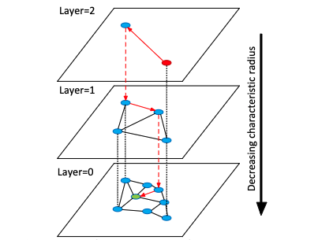  
    图 1. 分层 NSW 思想的示意图。搜索从顶层的一个元素开始（红色显示）。红色箭头表示从入口点到查询点（绿色显示）的贪婪算法方向。

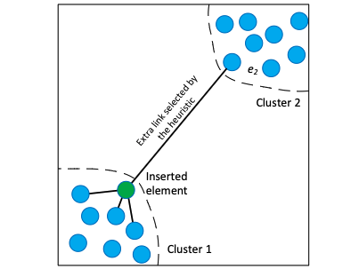  
    图 2. 用于选择两个孤立聚类的近邻图的启发式方法示意图。一个新元素被插入到聚类 1 的边界上。该元素的所有最近邻都属于聚类 1，因此会错过聚类之间德洛内图的边。然而，该启发式方法选择了来自聚类 2 的元素 e2，从而在插入的元素相比聚类 1 中的其他任何元素更接近 e2 的情况下，保持了全局连通性。

在元素插入过程中，为选择邻近图的连接，我们使用了一种启发式方法，该方法考虑候选元素之间的距离，以创建多样化的连接（类似的算法曾在空间近似树 [4] 中用于选择树的子节点），而不仅仅是选择最近的邻居。该启发式方法从最接近插入元素的候选开始检查，并仅在候选元素相对于基准（插入的元素）比任何已连接的候选元素更近时，才创建与该候选的连接（详见第 4 节）。  

当候选元素的数量足够多时，该启发式方法可以得到精确的相对邻域图 [46] 作为子图，这是德洛内图的一个最小子图，仅通过节点之间的距离即可推导出。相对邻域图即使在数据高度聚类的情况下，也能轻松保持全局连通组件（见图 2 示例）。需要注意的是，与精确的相对邻域图相比，该启发式方法会创建额外的边，从而可以控制连接的数量，这对于搜索性能至关重要。在一维数据的情况下，该启发式方法仅通过元素之间的距离信息即可获得精确的德洛内子图（在这种情况下与相对邻域图一致），从而实现从分层 NSW 到一维概率跳表算法的直接过渡。 

分层 NSW 邻近图的基础变体也在文献 [18] 中用于邻近图搜索（称为“稀疏邻域图”）。类似的启发式方法也是 FANNG 算法 [47] 的研究重点（该算法在当前论文初版发布在线后不久发表），但其解释稍有不同，基于稀疏邻域图的精确路由特性 [18]。

## 算法描述
网络构建算法（算法1）通过将存储的元素连续插入图结构中进行组织。对于每个插入的元素，最大层级 l 是通过指数衰减的概率分布随机选择的（由 $m_{\text{L}}$ 参数归一化，详见算法1的第4行）。

插入过程的第一阶段从顶层开始，通过贪婪地遍历图结构，在该层中找到与插入元素 \(q\) 最近的 \(ef\) 个邻居。之后，算法使用上一层找到的最近邻作为进入点，从下一层继续搜索，并重复这一过程。在每一层中，最近邻通过算法2中描述的贪婪搜索算法的变体找到，该算法是文献 [26] 中算法的更新版本。

为了在某一层 \(l_c\) 中获得近似的 \(ef\) 个最近邻，搜索过程中会维护一个动态列表 \(W\)，其中存储了 \(ef\) 个已找到的最近元素（初始时由进入点填充）。在每一步中，通过评估列表中之前未被评估的最近元素的邻域来更新该列表，直到列表中每个元素的邻域都被评估为止。

与限制距离计算次数的方法相比，分层 NSW 的停止条件具有优势——它允许丢弃比列表中最远元素距离查询点更远的候选评估对象，从而避免了搜索结构的膨胀。与 NSW 类似，该列表通过两个优先队列模拟以提高性能。与 NSW 的区别（以及一些队列优化）包括：

1. 进入点是一个固定参数；
2. 搜索质量不是通过改变多次搜索的数量来控制，而是通过一个不同的参数 \(ef\) 来控制（在 NSW [26] 中，\(ef\) 被设置为 \(K\)）。

在搜索的第一阶段，`ef` 参数被设置为 1（简单贪婪搜索），以避免引入额外的参数。

当搜索到达等于或小于 `l` 的层时，构建算法的第二阶段开始。第二阶段在两个方面有所不同：  
 1) 将 `ef` 参数从 1 增加到 `efConstruction`，以控制贪婪搜索过程的召回率；  
 2) 每一层找到的最近邻居也会被用作插入元素的连接候选。  
 
 针对从候选中选择 `M` 个邻居的方法，考虑了两种方式：  
 - 简单地连接到最近的元素（算法 3）；  
 - 使用一种启发式方法，该方法考虑候选元素之间的距离，以在不同方向上创建多样化的连接（算法 4），详见第 3 节。  
 
 启发式方法有两个额外的参数：  
 - `extendCandidates`（默认设置为 false），用于扩展候选集，仅对极度聚集的数据有用；  
 - `keepPrunedConnections`，允许为每个元素获取固定数量的连接。  
 
每层中元素的最大连接数由参数 `Mmax` 定义（对于高于零的每一层）。地面层（第 0 层）单独使用特殊参数 `Mmax0`。如果在创建新连接时某个节点已经达到最大连接数，则它的扩展连接列表会通过用于邻居选择的相同算法（算法 3 或算法 4）进行裁剪。

插入过程在插入元素的连接在第 0 层建立时终止。


层次化NSW（Hierarchical NSW）中使用的 **K-ANNS 搜索算法** 如算法 5 所示。它大致等同于层级为 `l=0` 的项的插入算法。不同之处在于，找到的底层（ground layer）最近邻元素现在作为搜索结果返回，而不是作为连接的候选项。搜索的质量由参数 `ef` 控制（在构建算法中对应于 `efConstruction`）。

---

 ### **算法1**
**INSERT(hnsw, q, M, Mmax, efConstruction, mL)**  
**输入：**  
- multilayer graph hnsw: 多层图 hnsw  
- new element q: 新元素 q  
- \(M\): 已建立连接的数量 M  
- $M_{\text{max}}$ : 每层中每个元素的最大连接数 Mmax  
- size of the dynamic candidate list efConstruction: 动态候选列表的大小 efConstruction  
- normalization factor for level generation mL: 层级生成的归一化因子 mL  

**输出：**  
- update hnsw inserting element q: 更新后的 hnsw，插入了元素 q  

```plaintext
1  W ← ∅ // 当前找到的最近邻元素列表
2  ep ← get enter point for hnsw // 获取 hnsw 的进入点
3  L ← level of ep // ep 的层级（hnsw 的顶层）
4  l ← ⌊-ln(unif(0..1))∙mL⌋ // 新元素的层级
5  for lc ← L … l+1
6      W ← SEARCH-LAYER(q, ep, ef=1, lc) // 在层 lc 中搜索
7      ep ← get the nearest element from W to q // 从 W 中获取与 q 最近的元素
8  for lc ← min(L, l) … 0
9      W ← SEARCH-LAYER(q, ep, efConstruction, lc) // 在层 lc 中搜索
10     neighbors ← SELECT-NEIGHBORS(q, W, M, lc) // 使用算法3或算法4选择邻居
11     add bidirectionall connectionts from neighbors to q at layer lc // 在层 lc 中从 neighbors 到 q 添加双向连接
12     for each e ∈ neighbors // 如果需要，收缩连接
13         eConn ← neighbourhood(e) at layer lc // e 在层 lc 中的邻域
14         if │eConn│ > Mmax // 如果 e 的连接数超过 Mmax，收缩 e 的连接
           // 如果 lc = 0，则 Mmax = Mmax0
15             eNewConn ← SELECT-NEIGHBORS(e, eConn, Mmax, lc) // 使用算法3或算法4选择新的连接
16             set neighbourhood(e) at layer lc to eNewConn // 将 e 在层 lc 的邻域设置为 eNewConn
17     ep ← W // 更新进入点 ep
18 if l > L
19     set enter point for hnsw to q // 将 hnsw 的进入点设置为 q
```
---

### **算法 2**
**SEARCH-LAYER(q, ep, ef, lc)**  
**输入：**  
- \(q\): 查询元素  
- \(ep\): 进入点集合  
- \(ef\): 需要返回的与 \(q\) 最近的元素数量  
- \(lc\): 层级编号  

**输出：**  
- \(ef\) 个与 \(q\) 最近的邻居

---

```plaintext
1  v ← ep // 已访问的元素集合
2  C ← ep // 候选集合
3  W ← ep // 动态维护的最近邻集合
4  while │C│ > 0
5      c ← 从 C 中提取离 q 最近的元素
6      f ← 从 W 中获取离 q 最远的元素
7      if distance(c, q) > distance(f, q)
8          break // W 中的所有元素都已被评估
9      对 c 在层 lc 中的邻域中的每个元素 e // 更新 C 和 W
10         if e ∉ v
11             v ← v ⋃ e // 将 e 加入已访问集合
12             f ← 从 W 中获取离 q 最远的元素
13             if distance(e, q) < distance(f, q) 或 │W│ < ef
14                 C ← C ⋃ e // 将 e 加入候选集合
15                 W ← W ⋃ e // 将 e 加入最近邻集合
16                 if │W│ > ef
17                     从 W 中移除离 q 最远的元素
18  return W // 返回最近邻集合
```
---

### 算法 3：
**SELECT-NEIGHBORS-SIMPLE(q, C, M)**

**输入**：  
- 基准元素 `q`  
- 候选元素集合 `C`  
- 需要返回的邻居数量 `M`  

**输出**：  
- 与 `q` 最近的 `M` 个元素  

**操作**：  
从集合 `C` 中返回与 `q` 最近的 `M` 个元素  

---

**算法 4**  
**SELECT-NEIGHBORS-HEURISTIC(q, C, M, lc, extendCandidates, keepPrunedConnections)**  
**输入：**  
基础元素 `q`，候选元素集合 `C`，要返回的邻居数量 `M`，层级编号 `lc`，是否扩展候选列表的标志 `extendCandidates`，是否添加被丢弃元素的标志 `keepPrunedConnections`。  
**输出：**  
根据启发式方法选择的 `M` 个元素。  

````markdown
1  R ← ∅  
2  W ← C // 候选元素的工作队列  
3  if extendCandidates // 通过邻居扩展候选元素  
4      for each e ∈ C  
5          for each eadj ∈ neighbourhood(e) at layer lc  
6              if eadj ∉ W  
7                  W ← W ⋃ eadj  
8  Wd ← ∅ // 被丢弃候选元素的队列  
9  while │W│ > 0 and │R│< M  
10      e ← extract nearest element from W to q  
11      if e is closer to q compared to any element from R  
12          R ← R ⋃ e  
13      else  
14          Wd ← Wd ⋃ e  
15  if keepPrunedConnections // 添加部分被丢弃的连接  
16      while │Wd│> 0 and │R│< M  
17          R ← R ⋃ extract nearest element from Wd to q  
18  return R
````
---

**算法 5**  
**K-NN-SEARCH(hnsw, q, K, ef)**  
**输入：**  
多层图 `hnsw`，查询元素 `q`，需要返回的最近邻数量 `K`，动态候选列表的大小 `ef`。  
**输出：**  
`q` 的 `K` 个最近邻元素。  

````markdown
1  W ← ∅ // 当前最近元素的集合  
2  ep ← get enter point for hnsw  
3  L ← level of ep // hnsw 的顶层  
4  for lc ← L … 1  
5      W ← SEARCH-LAYER(q, ep, ef=1, lc)  
6      ep ← get nearest element from W to q  
7  W ← SEARCH-LAYER(q, ep, ef, lc=0)  
8  return K nearest elements from W to q  
````
---

### 4.1 构建参数的影响

算法构建参数参数 `mL` 和 `Mmax0` 负责在构建的图中维持小世界的可导航性。将 `mL` 设置为零（这对应于图中的单层）且 `Mmax0` 设置为 `M`，会生成具有幂律搜索复杂度的定向 k-NN 图，这种复杂度已在之前的研究中得到充分研究 [21, 29]（假设使用算法 3 进行邻居选择）。将 `mL` 设置为零且 `Mmax0` 设置为无穷大，会生成具有多对数复杂度的 NSW 图 [25, 26]。最后，将 `mL` 设置为一个非零值会生成可控的分层图，通过引入层级结构实现对数级的搜索复杂度（详见第 3 节）。

为了实现可控分层结构的最佳性能优势，不同层之间邻居的重叠（即属于某一元素邻居的节点同时也属于其他层的比例）必须较小。为了减少这种重叠，我们需要降低 `mL` 的值。然而，同时降低 `mL` 会导致每层中贪婪搜索的平均跳数增加，从而对性能产生负面影响。这表明参数 `mL` 存在一个最佳值。

**一个简单的 `mL` 最优选择** 是 `1/ln(M)`，这对应于跳表参数 `p=1/M`，并在层之间的单个元素重叠平均值上表现良好。在 Intel Core i7 5930K CPU 上进行的模拟实验表明，所提出的 `mL` 选择是一个合理的选项（有关 10M 个随机 d=4 向量的数据，请参见图 3）。此外，图表显示，当从零增加 `mL` 时，在低维数据上会有显著的加速效果，同时也展示了使用启发式方法选择图连接的影响。

对于高维数据，难以预期会有相同的行为，因为在这种情况下，k-NN 图已经具有非常短的贪婪算法路径 [28]。令人惊讶的是，即使在非常高维的数据（如 100k 个稠密的随机 d=1024 向量，见图 4）上，从零增加 `mL` 也会带来可测量的速度提升，同时不会对分层 NSW 方法引入任何性能损失。

对于真实数据（例如 SIFT 向量 [1]，其具有复杂的混合结构），通过增加 `mL` 所带来的性能提升更高，但相比于启发式方法的改进，在当前设置下表现不那么显著（有关 BIGANN [13] 学习集中的 500 万个 128 维 SIFT 向量的 1-NN 搜索性能，请参见图 5）。

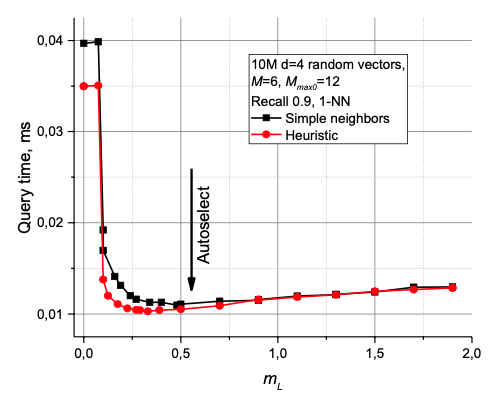
**图 3.** 查询时间与 `mL` 参数的关系图（适用于 10M 个随机向量，维度 `d=4`）。自动选择的 `mL` 值 `1/ln(M)` 由箭头标出。  

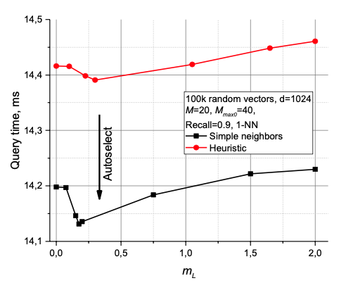
**图 4.** 查询时间与 `mL` 参数的关系图（适用于 100k 个随机向量，维度 `d=1024`）。自动选择的 `mL` 值 `1/ln(M)` 由箭头标出。

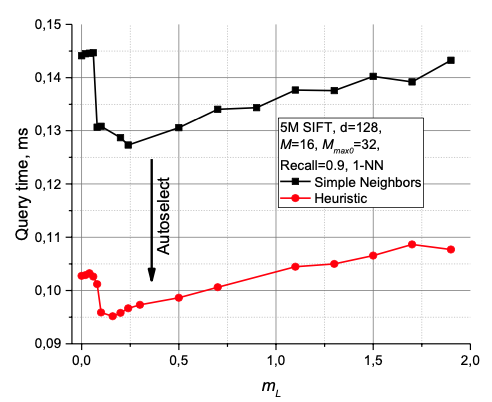
**图 5.** 查询时间与 `mL` 参数的关系图（适用于 500 万个 SIFT 学习数据集）。自动选择的 `mL` 值 `1/ln(M)` 由箭头标出。

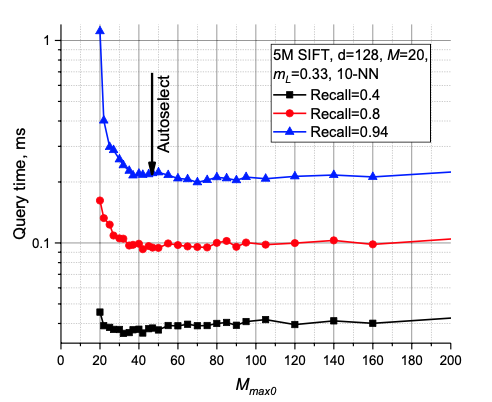
**图 6.** 查询时间与 Mmax0 参数在 5M SIFT 学习数据集上的关系图。自动选择的 Mmax0 值 2∙M 用箭头表示。

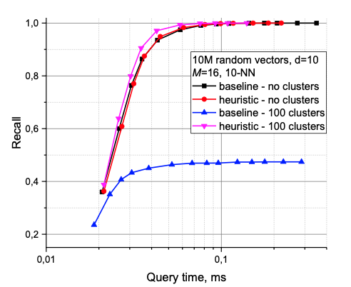
**图 7.** 邻居选择方法的影响（基线对应算法 3，启发式对应算法 4）在聚类数据（100 个随机孤立的聚类）和非聚类 d=10 的随机向量数据上的表现。

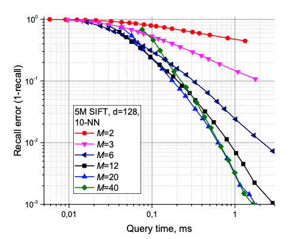
**图 8.** 在 5M SIFT 学习数据集上，不同 M 参数下 Hierarchical NSW 的召回误差与查询时间关系图。


**图 9.** 在 10M SIFT 数据集上，使用两个 CPU 和不同线程数时 Hierarchical NSW 的构建时间。

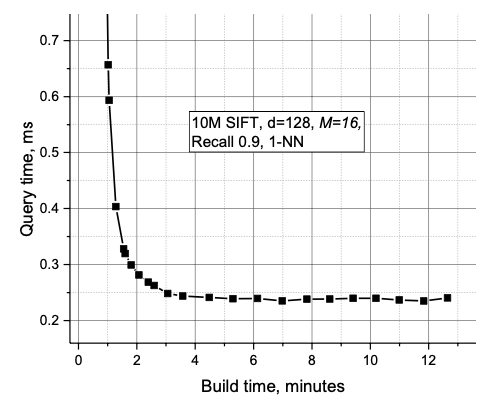
**图 10.** 在 10M SIFT 数据集上，Hierarchical NSW 查询时间与构建时间权衡关系的图示。

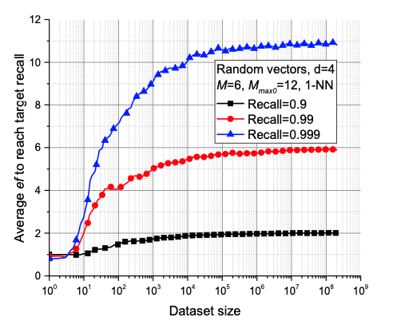
**图 11.** 为达到固定精度所需的 ef 参数与数据集大小在 d=4 随机向量数据上的关系图。

**选择 `Mmax0`**（即零层中一个元素可以拥有的最大连接数）对搜索性能有很大的影响，尤其是在高质量（高召回率）搜索的情况下。模拟实验表明，将 `Mmax0` 设置为 `M`（如果不使用邻居选择启发式方法，这对应于每层的 k-NN 图）会在高召回率时导致非常大的性能损失。模拟还表明，将 `Mmax0` 设置为 `2∙M` 是一个不错的选择：将该参数设置得更高会导致性能下降并产生过多的内存使用。

在图 6 中，展示了针对 500 万 SIFT 学习数据集的搜索性能结果，这些结果取决于 `Mmax0` 参数（在 Intel Core i5 2400 CPU 上完成）。推荐的值在不同召回率下提供了接近最佳的性能。

在所有考虑的情况下，使用启发式方法选择邻近图的邻居（算法 4）相比于直接连接到最近邻（算法 3），会带来更高或相似的搜索性能。这种效果在低维数据、高召回率的中维数据以及高度聚类的数据（从理论上讲，不连续性可以被视为一种局部低维特征）中最为显著。请参见图 7（Core i5 2400 CPU）中的对比。当在邻近图中使用最近邻作为连接时，分层 NSW 算法在处理聚类数据时无法实现高召回率，因为搜索会停滞在聚类的边界处。相反，当使用启发式方法（结合候选扩展，算法 4 的第 3 行）时，聚类反而会带来更高的性能。

对于均匀分布和非常高维的数据，两种邻居选择方法之间的差异很小（见图 4），这可能是因为在这种情况下，几乎所有最近邻都被启发式方法选择了。  

用户唯一需要选择的有意义的构建参数是 `M`。一个合理的 `M` 范围是从 5 到 48。模拟实验表明，较小的 `M` 通常在低召回率和/或低维数据的情况下表现更好，而较大的 `M` 更适合高召回率和/或高维数据（参见图 8，Core i5 2400 CPU）。该参数还决定了算法的内存消耗（与 `M` 成正比），因此需要谨慎选择。

`efConstruction` 参数的选择相对简单。正如文献 [26] 中所建议的，它需要足够大，以便在构建过程中实现接近 1 的 K-ANNS 召回率（对于大多数使用场景，0.95 已经足够）。并且同样如文献 [26] 所述，可以通过使用样本数据进行自动配置。

构建过程可以很容易且高效地并行化，仅需少量同步点（如图 9 所示），且对索引质量没有可测量的影响。构建速度与索引质量的权衡由 `efConstruction` 参数控制。对于 1000 万 SIFT 数据集，图 10 展示了搜索时间与索引构建时间之间的权衡关系。结果表明，在一台配备 4×2.4 GHz 10 核 Xeon E5-4650 v2 CPU 的服务器上，将 `efConstruction` 设置为 100 时，仅需 3 分钟即可构建一个合理质量的索引。进一步增加 `efConstruction` 参数虽能带来少量额外性能提升，但代价是显著更长的构建时间。

### 4.2 复杂度分析
#### 4.2.1 查询复杂度
单次搜索的复杂度扩展可以在假设我们构建的是精确的德劳内图而非近似图的情况下进行严格分析。假设我们在某一层找到了最近的元素（通过德劳内图可以保证这一点），然后下降到下一层。可以证明，在找到该层最近元素之前的平均步骤数是被一个常数所限制的。

确实，各层与数据元素的空间位置无关，因此，当我们遍历图时，下一个节点属于上一层的概率是固定的，即 `p = exp(-mL)`。然而，在某一层的搜索总是在到达属于更高层的元素之前终止（否则更高层的搜索会停在不同的元素上），因此在第 `s` 步没有到达目标的概率被限制为 `exp(-s·mL)`。因此，该层中期望的步数由几何级数的和 `S = 1/(1-exp(-mL))` 限制，而这一值与数据集的大小无关。

如果我们假设在数据集足够大的情况下，德劳内图中一个节点的平均度数被限制为一个常数 `C`（对于随机欧几里得数据 [48] 是成立的，但在某些特殊空间中原则上可能被违反），那么在某一层中总体的平均距离计算次数被限制为一个常数 `C·S`，且与数据集的大小无关。

由于通过构建可知，最大层索引的期望值按 \(O(\log(N))\) 进行扩展，因此总体复杂度扩展为 \(O(\log(N))\)，这与在低维数据集上的模拟结果一致。

由于在 Hierarchical NSW 中使用了基于固定每个元素邻居数量的近似边选择启发式方法，最初关于精确德劳内图的假设被违反。因此，为了避免陷入局部最小值，贪心搜索算法在第 0 层采用了回溯过程。模拟表明，至少对于低维数据（如图 11，d=4），为了获得固定的召回率，所需的 `ef` 参数（通过回溯过程中的最小跳数决定复杂度）与数据集大小的增加呈现饱和趋势。回溯的复杂度是相对于最终复杂度的一个附加项，因此，从实证数据可以看出，德劳内图近似的不准确性并未改变复杂度的扩展规律。

对德劳内图近似弹性的这种实证研究需要保证德劳内图的平均边数与数据集无关，以验证在 Hierarchical NSW 中如何通过固定数量的连接来近似这些边。然而，德劳内图的平均度数随着维度呈指数级增长（[39]），因此对于高维数据（例如 d=128），上述条件需要极其庞大的数据集才能满足，使得这种实证研究变得不可行。进一步的分析性证据是必要的，以确认德劳内图近似的弹性是否可以推广到更高维空间。

#### 4.2.2 构建复杂度

构建过程是通过逐步插入所有元素完成的，而插入一个元素仅仅是不同层上执行一系列 K-ANN 搜索，随后使用启发式方法（在固定的 `efConstruction` 下具有固定复杂度）。对于一个元素，其需要插入的层的平均数量是一个依赖于 `mL` 的常数：

\[
\mathbb{E}[l+1] = \mathbb{E}[\ln(1/\text{unif}(0,1))/m] + 1 = 1 + 1/m
\]

因此，插入的复杂度扩展与搜索的复杂度相同，这意味着至少对于相对低维的数据集，构建时间的扩展为 \(O(N \cdot \log(N))\)。

#### 4.2.3 内存成本
Hierarchical NSW 的内存消耗主要由图连接的存储决定。每个元素在第 0 层的连接数为 \( M_{\text{max0}} \)，在其他所有层的连接数为 \( M_{\text{max}} \)。因此，每个元素的平均内存消耗可以表示为：

\[
\text{Memory per element} = \left( M_{\text{max0}} + m_L \cdot M_{\text{max}} \right) \cdot \text{bytes\_per\_link}
\]

如果将元素的最大总数限制在约 \( 4 \times 10^9 \) 个以内，可以使用 4 字节的无符号整数来存储这些连接。

测试表明，接近最优的 \( M \) 值通常位于范围：

\[
6 \leq M \leq 48
\]

这意味着索引的典型内存需求（不包括数据的大小）约为每个对象 \( 60 \sim 450 \) 字节，这与模拟结果高度一致。

## 性能评估
Hierarchical NSW 算法在 Non Metric Space Library (nmslib)[49]1 的基础上用 C++ 实现，该库已经包含了一个功能完善的 NSW 实现（名称为 “sw-graph”）。由于该库存在一些限制，为了获得更好的性能，Hierarchical NSW 的实现采用了自定义距离函数，并结合 C 风格的内存管理。这种方法避免了不必要的隐式寻址，并在图遍历过程中实现了高效的硬件和软件预取操作。

比较 K-ANNS 算法的性能是一项复杂的任务，因为随着新算法和实现的不断涌现，技术前沿也在不断变化。在这项工作中，我们专注于与欧几里得空间中具有开源实现的最佳算法进行比较。本文中提出的 Hierarchical NSW 算法的实现也作为开源 nmslib 库的一部分发布，同时提供了一个外部的 C++ 内存高效、仅头文件的版本，并支持增量索引构建。

比较部分由四个部分组成：与基线 NSW 的比较（5.1）、与欧几里得空间中最先进算法的比较（5.2）、在一般度量空间中重新运行 NSW 失败的测试子集 [34]（5.3），以及与最先进的 PQ 算法在一个包含 2 亿条 SIFT 数据的大型数据集上的比较（5.4）。

### 5.1 NSW 与基线 NSW 的比较
对于基线 NSW 算法的实现，我们使用了 nmslib 1.1 中的 “sw-graph”（相比 [33, 34] 中测试的实现略有更新），以展示在速度和算法复杂性（通过距离计算次数衡量）方面的改进。

图 12(a) 展示了在 d=4 的随机超立方体数据上，Hierarchical NSW 与基本 NSW 算法的比较（在 Core i5 2400 CPU 上进行 10-NN 搜索）。在数据集的搜索过程中，尤其是在高召回率时，Hierarchical NSW 使用了更少的距离计算。

图 12(b) 展示了在 d=8 的随机超立方体数据集上进行 10-NN 搜索（固定召回率为 0.95）时算法的扩展性。这清楚地表明，在这种设置下，Hierarchical NSW 的复杂度扩展性不逊于对数级别，并且在任何数据集规模下都优于 NSW。由于算法实现的改进，其在绝对时间上的性能优势（图 12(c)）甚至更为显著。

### 5.2 欧几里得空间中的比较
比较的主要部分是在向量数据集上进行的，使用了流行的 K-ANNS 基准测试工具 **ann-benchmark** 作为测试平台。测试系统通过算法的 Python 绑定运行——它依次对一千个查询（从初始数据集中随机提取）进行 K-ANN 搜索，并使用预设的算法参数生成输出，其中包含召回率和单次搜索的平均时间。所考虑的算法包括：
    1. 来自 nmslib 1.1 的基线 NSW 算法（“sw-graph”）。
    2. FLANN 1.8.4 [6]。这是一个流行的库，包含多种算法，并内置于 OpenCV 中。我们使用了可用的自动调优程序，并通过多次运行推导出最佳参数。
    3. Annoy6，02.02.2016 版本。一个基于随机投影树森林的流行算法。
    4. VP-tree。一种带有度量剪枝功能的通用度量空间算法 [50]，实现为 nmslib 1.1 的一部分。
    5. FALCONN7，版本 1.2。一种用于余弦相似度数据的新型高效 LSH 算法 [51]。

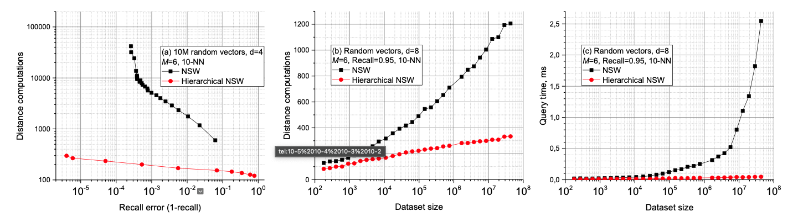
**图 12.** NSW 和 Hierarchical NSW 的对比：(a) 在一个包含 1000 万个 4 维随机向量的数据集上，距离计算次数与准确率之间的权衡；(b-c) 在一个 8 维随机向量数据集上，距离计算次数 (b) 和原始查询时间 (c) 的性能扩展性。

---

### TABLE 1  
**向量空间基准测试中所用数据集的参数**

| 数据集          | 描述                                    | 数据量      | 维度 (d) | 暴力搜索时间 (BF time) | 空间 (Space) |
|-----------------|-----------------------------------------|-------------|----------|-----------------------|--------------|
| **SIFT**        | 图像特征向量 [13]                      | 1M          | 128      | 94 ms                | L            |
| **GloVe**       | 基于推文训练的词嵌入 [52]              | 1.2M        | 100      | 55 ms                | cosine       |
| **CoPhIR**      | 从图像中提取的 MPEG7 特征 [53]         | 2M          | 272      | 370 ms               | L            |
| **Random vectors** | 超球体中的随机向量                    | 30M         | 4        | 590 ms               | L            |
| **DEEP**        | 十亿深度图像特征数据集的一个子集 [14]  | 1M          | 96       | 60 ms                | L            |
| **MNIST**       | 手写数字图像 [54]                      | 60k         | 784      | 22 ms                | L            |

---

### TABLE 2  
**用于重复非度量数据测试子集的数据集**

| 数据集           | 描述                                                                 | 数据量   | 维度 (d) | 暴力搜索时间 (BF time) | 距离度量           |
|------------------|----------------------------------------------------------------------|----------|----------|-----------------------|--------------------|
| **Wiki-sparse**  | 稀疏 TF-IDF（term frequency-inverse document frequency）向量，通过 GENSIM [58] 创建 | 4M       | 10⁵       | 5.9 s                 | Sparse cosine      |
| **Wiki-8**       | 从 Wiki-sparse 数据集的稀疏 TF-IDF 向量创建的主题直方图，通过 GENSIM [58] 创建  | 2M       | 28        | -                     | Jensen–Shannon (JS) divergence |
| **Wiki-128**     | 从 Wiki-sparse 数据集的稀疏 TF-IDF 向量创建的主题直方图，通过 GENSIM [58] 创建  | 2M       | 128       | 1.17 s                | Jensen–Shannon (JS) divergence |
| **ImageNet**     | 从 LSVRC-2014 提取的签名，使用 SQFD（signature quadratic form）距离 [59] | 1M       | 272       | 13.3 s                | SQFD               |
| **DNA**          | DNA（脱氧核糖核酸）数据集，取自人类基因组 5 [34]                      | 1M       | -         | 2.4 s                 | Levenshtein        |

---

比较是在一台配备 **4X Xeon E5-4650 v2** 处理器、运行 **Debian 操作系统**、拥有 **128 GB RAM** 的系统上完成的。对于每种算法，我们在每个召回范围内仔细选择了最佳结果，以评估可能的最佳性能（初始值来源于测试平台的默认设置）。所有测试均在 **单线程模式** 下进行。**Hierarchical NSW** 使用 **GCC 5.3** 编译，并采用 **-Ofast** 优化标志。

所使用数据集的参数和描述列在表 1 中。对于除 GloVe 以外的所有数据集，我们使用了 L2 距离。对于 GloVe，我们使用了余弦相似度，在向量归一化后它等价于 L2 距离。暴力搜索（BF）时间是通过 nmslib 库测量的。  

向量数据的结果如图 13 所示。对于 SIFT、GloVE、DEEP 和 CoPhIR 数据集，Hierarchical NSW 明显以较大优势超越了竞争对手。对于低维数据（d=4），在高召回率的情况下，Hierarchical NSW 比 Annoy 略快，同时显著优于其他算法。

### 5.3 通用空间比较
最近一项关于一般空间（即非对称或违反三角不等式的空间）中算法的比较研究 [34] 表明，基础的 NSW 算法在低维数据集上存在严重问题。为了测试 Hierarchical NSW 算法的性能，我们重复了 [34] 中的一部分测试，这些测试是 NSW 表现较差或次优的场景。为此，我们使用了 nmslib 内置的测试系统，该系统包含运行 [34] 中测试的脚本。

评估的算法包括 VP-tree、排列技术（NAPP 和暴力过滤）[49, 55-57]、基础 NSW 算法，以及由 NNDescent 生成的邻近图 [29]（两者均与 NSW 图搜索算法配对使用）。与原始测试中一样，对于每个数据集，测试包含 NSW 或 NNDescent 的结果，具体取决于哪个结构表现更好。在这种情况下，Hierarchical NSW 未使用自定义距离函数或特殊内存管理，这导致了一定的性能损失。

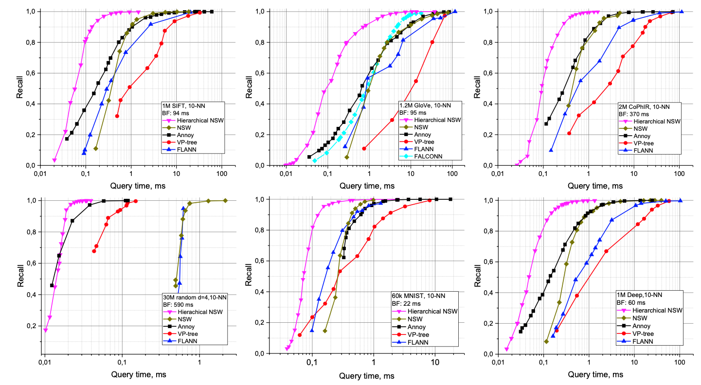
**图 13.** Hierarchical NSW 与 K-ANNS 算法的开源实现，在五个数据集上进行 10-NN 搜索的比较结果。暴力搜索的时间表示为 BF。

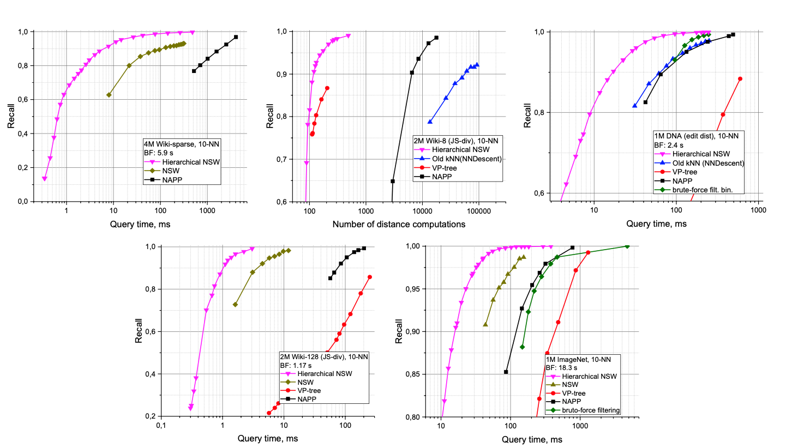
**图 14.** Hierarchical NSW 与 Non Metric Space Library 中的一般空间 K-ANNS 算法在五个数据集上进行 10-NN 搜索的比较结果。暴力搜索的时间表示为 BF。

### 表格 3  
**1B SIFT 数据集的 200M 子集上 Hierarchical NSW 与 Faiss 的参数对比**

| **算法**              | **构建时间** | **峰值内存（运行时）** | **参数**                                  |
|-----------------------|--------------|-----------------------|------------------------------------------|
| Hierarchical NSW      | 5.6 小时      | 64 GB                | M=16, efConstruction=500 (1)            |
| Hierarchical NSW      | 42 分钟       | 44 GB                | M=16, efConstruction=40 (2)             |
| Faiss                 | 12 小时       | 30 GB                | OPQ64, IMI2x14, PQ64 (4)                |
| Faiss                 | 11 小时       | 23.5 GB              | OPQ32, IMI2x14, PQ32 (2)                |

数据集概述如表 2 所示。有关数据集、空间和算法参数选择的更多详细信息可以在原始文献 [34] 中找到。暴力搜索（BF）的时间由 nmslib 库测量。

结果如图 14 所示。Hierarchical NSW 显著提升了 NSW 的性能，并在所有测试的数据集上都表现出领先地位。对于维度最低的数据集（使用 JS 散度的 wiki-8），Hierarchical NSW 相较于 NSW 的性能提升接近 3 个数量级。这是一个重要的结果，展示了 Hierarchical NSW 的鲁棒性，因为对于原始 NSW 来说，这个数据集曾是一个难点。需要注意的是，对于 wiki-8 数据集，为了消除实现的影响，结果以距离计算次数而非 CPU 时间来呈现。

### 5.4 与基于乘积量化的算法比较
乘积量化（Product Quantization，PQ）K-ANNS 算法 [10-17] 被认为是十亿级数据集上的最新技术，因为它们能够高效压缩存储数据，在现代 CPU 上实现毫秒级搜索时间的同时，仅占用适量的 RAM。

为了将 Hierarchical NSW 的性能与 PQ 算法进行比较，我们使用了 Facebook 的 Faiss 库作为基线（该库是一个实现了最新 PQ 算法 [12, 15] 的新库，在本文提交后发布），并使用 OpenBLAS 后端进行编译。测试在 1B SIFT 数据集 [13] 的 200M 子集上进行，运行环境为配备 128GB RAM 的 4X Xeon E5-4650 v2 服务器。由于 ann-benchmark 测试平台依赖于 32 位浮点格式（仅存储数据就需要超过 100GB 内存），因此无法用于这些实验。

为了获取 Faiss PQ 算法的结果，我们使用了内置的脚本，并采用 Faiss wiki 提供的参数配置 [9]。对于 Hierarchical NSW 算法，我们使用了一个独立于 nmslib 的特殊构建版本，该版本具有较小的内存占用、简单的非向量化整数距离函数，并支持增量索引构建 [10]。

结果如图 15 所示，参数概述见表 3。峰值内存消耗是通过在索引构建完成后，使用 Linux 的 “time -v” 工具在单独的测试运行中测量的。尽管 Hierarchical NSW 需要显著更多的 RAM，但它可以实现更高的准确性，同时在搜索速度上有大幅提升，并且索引构建速度也快得多。

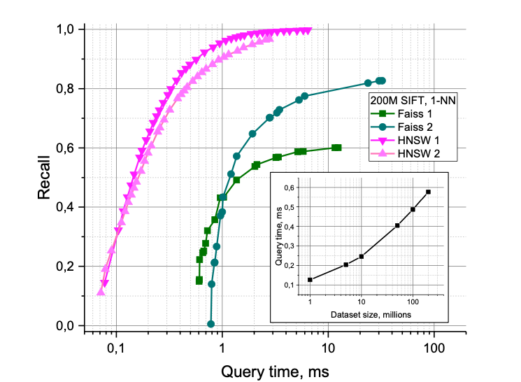
**图 15.** 在 200M SIFT 数据集 [13] 上与 Faiss 库的对比结果。插图显示了查询时间相对于数据集规模的扩展情况（针对 Hierarchical NSW）。

图 15 中的插图展示了 Hierarchical NSW 查询时间与数据集规模的扩展情况。需要注意的是，这种扩展偏离了纯对数关系，这可能是由于数据集的维度相对较高所导致的。

## 6 结论
通过结合可导航小世界图的结构分解和智能邻居选择启发式方法，提出的 Hierarchical NSW 方法克服了基本 NSW 结构的几个重要问题，在 K-ANN 搜索中推进了最新技术的进展。Hierarchical NSW 提供了出色的性能，在各种数据集上表现出明显的领先地位，尤其是在高维数据的情况下，其性能远远超过了开源竞争对手。即使对于之前的算法（NSW）在多个数量级上失利的数据集，Hierarchical NSW 也能够取得第一。

Hierarchical NSW 支持连续的增量索引构建，同时还可以作为一种高效的方法，用于生成 k-NN 和相对邻域图的近似，这些图是索引构建的副产品。该方法的鲁棒性是一项显著的优势，使其在实际应用中非常具有吸引力。该算法适用于广义度量空间，并且在本文测试的所有数据集上都表现最佳，从而消除了为特定问题选择最佳算法的复杂需求。

我们强调算法鲁棒性的重要性，因为数据可能具有复杂的结构，在不同尺度上表现出不同的有效维度。例如，一个数据集可能由位于一条曲线上的点组成，这条曲线随机填充一个高维立方体，因此在大尺度上是高维的，而在小尺度上是低维的。为了在这样的数据集中进行高效搜索，一个近似最近邻算法必须能够在高维和低维的情况下都表现良好。

有几种方法可以进一步提高 Hierarchical NSW 方法的效率和适用性。目前仍然有一个重要的参数对索引的构建有显著影响——每层添加的连接数 M。潜在地，这个参数可以通过使用不同的启发式方法直接推导得出 [4]。此外，将 Hierarchical NSW 应用于完整的 1B SIFT 和 1B DEEP 数据集 [10-14] 进行比较，并增加对元素更新和删除的支持，也将是一个有趣的研究方向。

与基本 NSW 方法相比，所提出方法的一个明显缺点是失去了分布式搜索的可能性。在 Hierarchical NSW 结构中，搜索总是从顶层开始，因此由于顶层元素的认知性，无法使用 [26] 中描述的相同技术使结构分布化。可以使用一些简单的变通方法将结构分布化，例如将数据分区到集群节点中（如 [6] 中研究的那样），但在这种情况下，系统的总并行吞吐量无法随着计算节点数量的增加而很好地扩展。

尽管如此，还有其他已知的方法可以使这种特定结构实现分布化。Hierarchical NSW 在理念上与众所周知的一维精确搜索概率跳表结构非常相似，因此可以使用相同的技术来实现结构的分布化 [45]。从潜力上看，这甚至可能比基本 NSW 实现更好的分布式性能，因为它具有对数级的可扩展性以及理想情况下在节点上的均匀负载分布。

## 7 致谢
我们感谢 Leonid Boytsov 在非度量空间库集成方面的诸多有益讨论、帮助以及对手稿的评论。我们感谢 Seth Hoffert 和 Azat Davletshin 对手稿和算法提出的建议，以及在 GitHub 仓库中为算法做出贡献的同仁们。我们还感谢 Valery Kalyagin 对本工作的支持。

本研究由俄罗斯基础研究基金会（RFBR）资助，资助项目编号为 16-31-60104 mol_а_dk。

# 8 参考文献
参考原文。